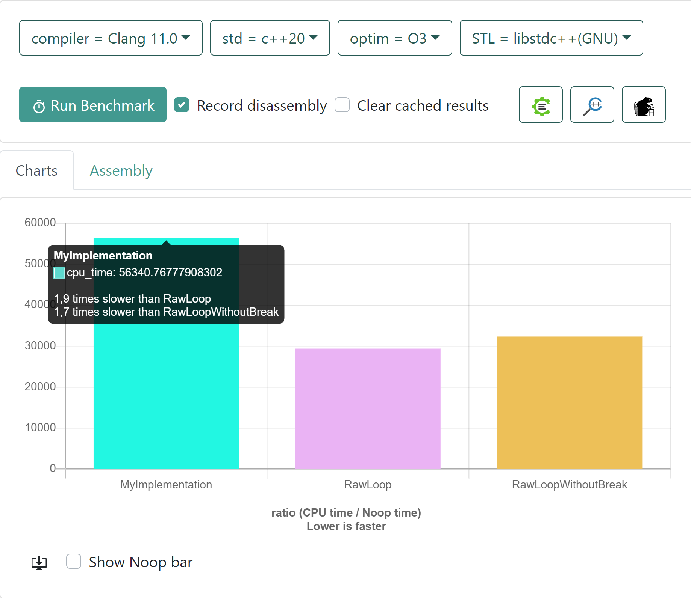
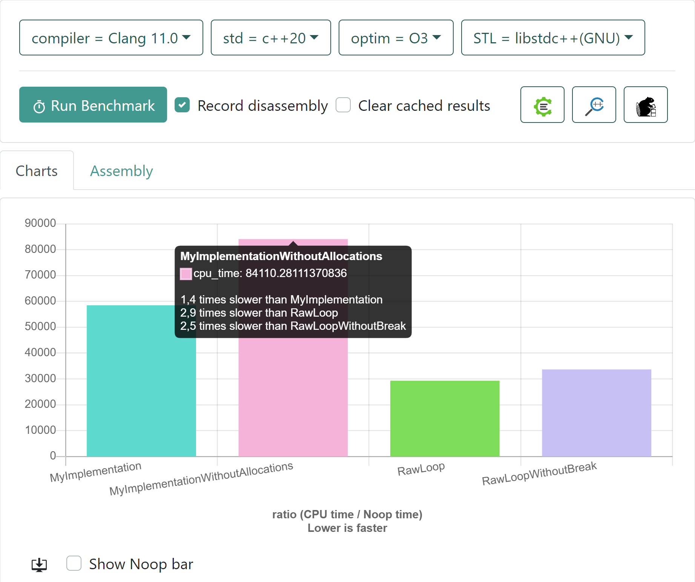
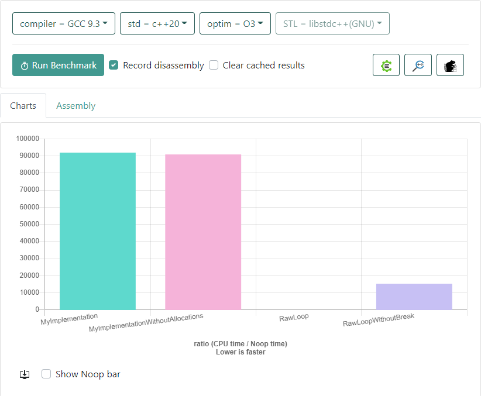
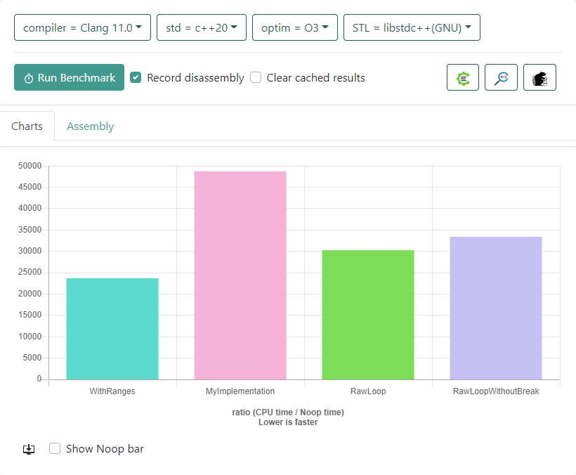
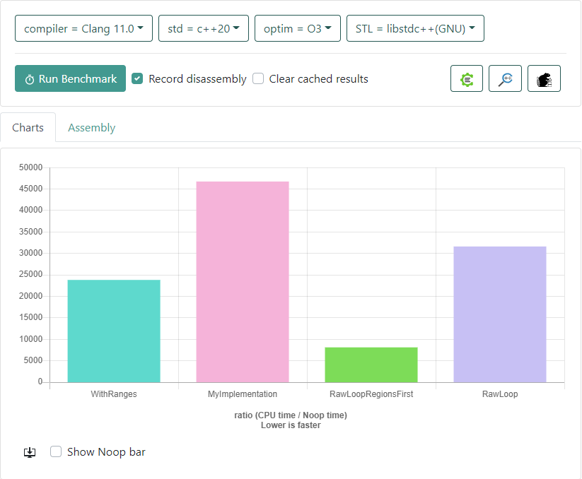

A little while ago I wrote some code that was counting how many points of a given vector of points fall into each quadrant of a region. I already had a function that would return a list of indices for a region, so here is roughly how I implemented it:

```cpp
#include <vector>
#include <array>

struct Point
{
    float x;
    float y;
};

struct Region
{
    Point top_left;
    Point bottom_right;

    [[nodiscard]] constexpr bool contains(const Point& point) const noexcept
    {
        return point.x > top_left.x && point.x < bottom_right.x && point.y > top_left.y && point.y < bottom_right.y;
    }
};

[[nodiscard]] std::vector<std::size_t> indices_in_region(const std::vector<Point>& points, const Region& region)
{
    std::vector<std::size_t> result;
    result.reserve(points.size());

    for( std::size_t i = 0; i < points.size(); ++i)
    {
        if( region.contains(points[i]))
        {
            result.emplace_back(i);
        }
    }
    return result;
}

std::array<Region,4> region_quadrants(const Region& region)
{
    auto half_width = region.bottom_right.x - region.top_left.x;
    auto half_height = region.bottom_right.y - region.top_left.y;
    return {
        Region{Point{region.top_left}, Point{region.top_left.x + half_width, region.top_left.y + half_height}},
        Region{Point{region.top_left.x + half_width, region.top_left.y}, Point{region.bottom_right.x, region.top_left.y + half_height}},
        Region{Point{region.top_left.x + half_width, region.top_left.y + half_height}, region.bottom_right},
        Region{Point{region.top_left.x, region.top_left.y + half_height}, Point{region.top_left.x + half_width, region.bottom_right.y}}
        };
}

int myImplementation()
{
    auto points = create_n_random_points(2000);
    auto regions = region_quadrants(Region{Point{0.0F,0.0F}, Point{100.F,100.F}});

    for( const auto& region : regions)
    {
        auto count = indices_in_region(points, region).size();
    }
}
```

I thought this was quite straightforward and I could reuse my function for computing the indices. However my collegue pointed out in a review that with this approach I am creating 4 new vectors and iterating 4 times over the complete sequence. He suggested to simply iterate once and increment a counter for the corresponding region.

Something like this:
```cpp
int rawLoop()
{
    auto points = create_n_random_points(2000);
    auto regions = region_quadrants(Region{Point{0.0F,0.0F}, Point{100.F,100.F}});
    std::array<size_t, 4> counters{0,0,0,0};
    for(const auto& point : points)
    {
        for( size_t i = 0; i < counters.size(); ++i)
        {
            if( regions[i].contains(point))
            {
                ++counters[i];
                break;
            }
        }
    }
}
```

So since this is about C++ and performance I was curious, how much does it actually matters and how does it influence the expressiveness of the code.

This blog post is here to document the result of the experiment. I already knew that for our use case we will have around 2000 points, so I stuck to that and did a quick comparison on [https://quick-bench.com/q/ZqyQ08se78fohsSdPkFgFqldfvI](quick-bench).

You can see the result in the following graph. I am actually a little suprised, I expected more of a difference than the 1.8 factor. Considering the allocations of the vector and the advantage that we can break earlier I thought the speedup would be more.



I added another RawLoop to check the impact of the break when we can terminate early but the effect is not very big, its a factor of 0.2 compared to my implementation that we gain.

What is left is probably used for the four vector allocations that we have. Lets try to eliminate them to confirm that suspicion. I tried with an out parameter instead of returning the vectors from function. I would hand in a vector, clear it and just append to it. [Here](https://quick-bench.com/q/ZwXa8jORXH766-VWIj0IIpZUCi4) is the benchmark and this is the result:



**It actually got slower**. This is a very good example of why you should always measure when you do performance improvements. I did a little investigation and it turns out that clearing the vector here is the culprit. I know that clear is an O(n) operation, however since we are dealing with a simple type `std::size_t` I thought it would be optimized out. Seems like it is not.

Additionally when comparing I found out the impact of the optimization is hugely compiler dependent. Since I am using quick-bench I can only measure the relative impact and not the overall one, but see for yourself, here is the exactly same code compiled and run with gcc-9.3.



**Whenever you do something for performance reasons, measure!**

## C++20 Ranges

This is not something I had available for my work but none the less lets compare it to an implementation using C++20s ranges.

```cpp
  auto points = create_n_random_points(2000);
  auto regions = region_quadrants(Region{Point{0.0F,0.0F}, Point{100.F,100.F}});
  
  for (auto _ : state) 
  {
    for( const auto& region : regions)
    {
        benchmark::DoNotOptimize(std::ranges::count_if(points, [&region](const auto& point){return region.contains(point);}));
    }
  }
```

This is one of the shortest and best implementations I can think of. Lets look at the benchmark [results](https://quick-bench.com/q/I2QwOKzO3qYE1KpOfWONSWsQ2L0):



It is faster! So the best implementation also wins in execution time. Apparently the optimizer can do a really good job using the ranges implementation. A difference to the raw loop approach is here we have an inverted the loop order. With ranges we iterate first over the regions, while the original suggestion was to only iterate over the points once.

Well lets compare:

## Raw loop with inverted order

The only change is that we switch the places of the two loops, iterating first over the smaller one with regions(4) then for each of them iterating over all the points(2000). This means that logically we have to perform more operations since we now need to iterate over all the points 4 times meaning we have to iterate over `4 x 2000 = 8000` elements in total. With the old approach we could break early when we had the region reducing the number of iterations.

[Here](https://quick-bench.com/q/Pj8H8SDcFnAqltSZfmCe4oaG82k) are the results:



And we have a winner! There is a tremendous difference to our range implementation as well as the original raw loop and all we did was invert the order of the loops. My guess for the reason is now there is no branching anymore, the entire operation is completely predictable for the processor, no need for a branch predictor and we have our data laid out optimally in cache. I cannot think of a way to beat that.

I could only tell after measuring the different approaches. Therefore whenever somebody (or you) reduces the expressiveness of the code with the argument of performance they should be able to prove it. It is worth spending some time to investigate it especially if you have such handy tools like quick-bench available.

## Further read

If you don't feel like having a loop at all then maybe you want to take a look at Jonathan Boccaras [pipes library](https://github.com/joboccara/pipes). With pure ranges I don't see a good way to achieve it. However pipes is meant for such things I believe (splitting the range in distinctive code paths with distinctive returns).

I did not try it out yet, but might be worth a shot.

### What I finally did

In the end I just did some minor improvements but did not choose the nested loop approach because I think it is harder to understand and not worth the impact.

This code is not on the hot path therefore it is unlikely that optimizing it has a meaningful impact. So I left the function close to the original. I was orginally comparing against a threshold so I could abort early and the function should look clear as day to any poor soul having to maintain my code.

```cpp
auto points = create_n_random_points(2000);
auto regions = region_quadrants(Region{Point{0.0F,0.0F}, Point{100.F,100.F}});

for( const auto& region : regions)
{
    auto count = indices_in_region(points, region).size();
    if( count < threshold)
    {
        return false;
    }
}
return true;
```

I would switch to a ranges based implementation if we had C++20 available, but unfortunately at my work place we are not yet there.